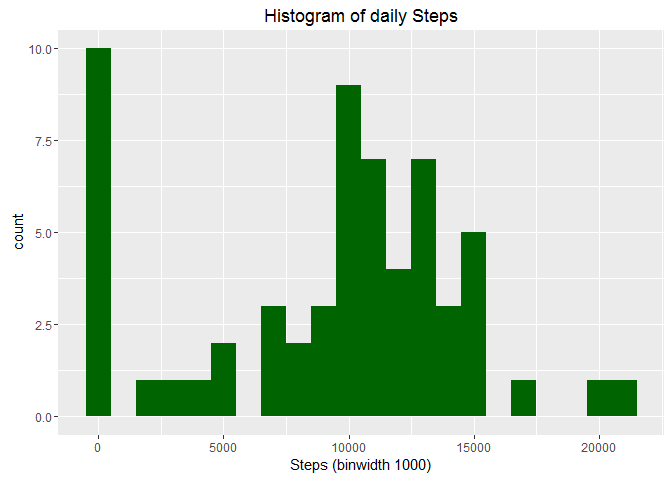
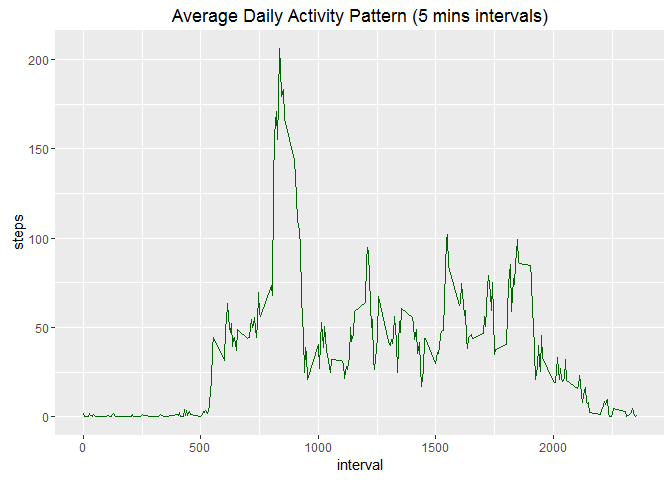
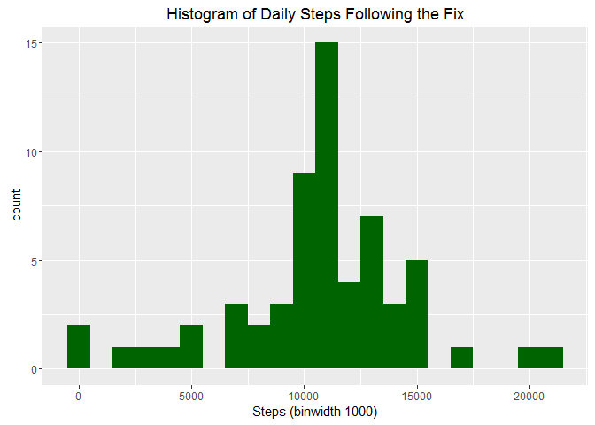
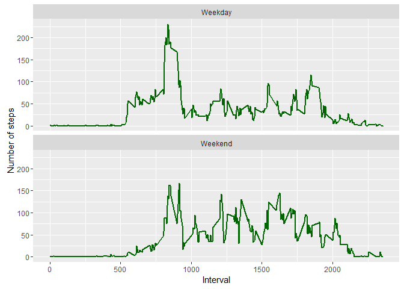

# Reproducible Research: Peer Assessment 1
Alex Semenov  


## Loading and preprocessing the data

```r
library(ggplot2)
```

```
## Warning: package 'ggplot2' was built under R version 3.2.4
```

```r
library(knitr)
```

```
## Warning: package 'knitr' was built under R version 3.2.5
```

```r
# Set echo = TRUE
opts_chunk$set(echo = TRUE, results = 'hold')
# Read in the data
activity_data <- read.csv("activity.csv")
# show some data
head(activity_data)
```

```
##   steps       date interval
## 1    NA 2012-10-01        0
## 2    NA 2012-10-01        5
## 3    NA 2012-10-01       10
## 4    NA 2012-10-01       15
## 5    NA 2012-10-01       20
## 6    NA 2012-10-01       25
```

```r
# Where necessary, pre-process the data, here we need to convert to date
activity_data$date <- as.Date(activity_data$date)
```


## What is mean total number of steps taken each day?

```r
# Need to aggregate the number of steps taken per day by date first
DailySteps <- aggregate(x = activity_data$steps , by = list(activity_data$date), FUN = sum ,na.rm=TRUE)
colnames(DailySteps) <- c("Date","steps")
histplot <- ggplot(DailySteps,aes(x = steps)) + ggtitle("Histogram of daily Steps") + xlab("Steps (binwidth 1000)") +
            geom_histogram(fill = "darkgreen",binwidth = 1000)
histplot
```

<!-- -->

* Average of total number of steps taken each day

```r
mean(DailySteps$steps , na.rm = TRUE)
```

```
## [1] 9354.23
```
* Median of total number of steps taken each day

```r
median(DailySteps$steps , na.rm = TRUE)
```

```
## [1] 10395
```

## What is the average daily activity pattern?
* Make a time series plot (i.e. type = "l") of the 5-minute interval (x-axis) and the average number of steps taken, averaged across all days (y-axis)

```r
AverageSteps <- aggregate(x = activity_data$steps , by = list(activity_data$interval), FUN = mean ,na.rm=TRUE)
colnames(AverageSteps) <- c("interval","steps")

AvgPlot <- ggplot(AverageSteps,aes(interval,steps)) +
                 ggtitle("Average Daily Activity Pattern (5 mins intervals)") +
                 geom_line(color = "darkgreen")
AvgPlot  
```

<!-- -->

* Which 5-minute interval, on average across all the days in the dataset, contains the maximum number of steps?

```r
AverageSteps[which.max(AverageSteps$steps),c("interval")]
```

```
## [1] 835
```

## Imputing missing values

* Calculate and report the total number of missing values in the dataset (i.e. the total number of rows with NAs)

```r
nrow(activity_data[is.na(activity_data$steps),])
```

```
## [1] 2304
```

* Devise a strategy for filling in all of the missing values in the dataset. The strategy does not need to be sophisticated. For example, you could use the mean/median for that day, or the mean for that 5-minute interval, etc.

```r
# Here im simply going to merge the data with the averages we have computed earlier and then
# replace the data with the averages where applicable
FixedData <- merge(x = activity_data, y = AverageSteps, by = "interval", all.x = TRUE)
```

* Create a new dataset that is equal to the original dataset but with the missing data filled in.

```r
FixedData[is.na(FixedData$steps.x),c("steps.x")] <- FixedData[is.na(FixedData$steps.x),c("steps.y")]
FixedData$date <- as.Date(FixedData$date)
FixedData$date.x <- NULL;FixedData$Group.1 <- NULL
FixedData$steps <- FixedData$steps.x
FixedData$steps.x <- NULL;FixedData$steps.y <- NULL
```
* Make a histogram of the total number of steps taken each day and Calculate and report the mean and median total number of steps taken per day. Do these values differ from the estimates from the first part of the assignment? What is the impact of imputing missing data on the estimates of the total daily number of steps?

```r
TotalSteps <- aggregate(x = FixedData$steps , by = list(FixedData$date), FUN = sum ,na.rm = TRUE)
colnames(TotalSteps) <- c("date","steps")
histplot <- ggplot(TotalSteps,aes(x = steps)) + ggtitle("Histogram of Daily Steps Following the Fix") + 
xlab("Steps (binwidth 1000)") + geom_histogram(fill = "darkgreen", binwidth = 1000)
histplot 
```

<!-- -->

* Mean after the fix

```r
mean(TotalSteps$steps)
```

```
## [1] 10766.19
```

* Median after the fix

```r
median(TotalSteps$steps)
```

```
## [1] 10766.19
```

## Are there differences in activity patterns between weekdays and weekends?
* First add factor variable with two levels for weekday and weekend

```r
# Factor variable with two levels indicating a weekday or weekend
FixedData$weekday <- as.factor(ifelse(weekdays(FixedData$date) %in% c("Saturday","Sunday"), "Weekend", "Weekday")) 

AverageByIntervalDay  <- aggregate(x = FixedData$steps,by = list(FixedData$interval,FixedData$weekday), FUN = mean ,na.rm = TRUE)
colnames(AverageByIntervalDay) <- c("interval","weekday","steps")

# plot the average across the Weekend and the Weekdays
ggplot(AverageByIntervalDay, aes(x=interval, y=steps)) + geom_line(color="darkgreen", size = 1) + 
        facet_wrap(~ weekday, nrow=2, ncol = 1) + labs(x="Interval", y="Number of steps")
```

<!-- -->

## To wrap it up and answer last question
* As can be seen from the two graphs, the workouts during the weekend have more peaks, which
would suggest that people are more active on the weekends than the weekdays (given the burst of steps)
